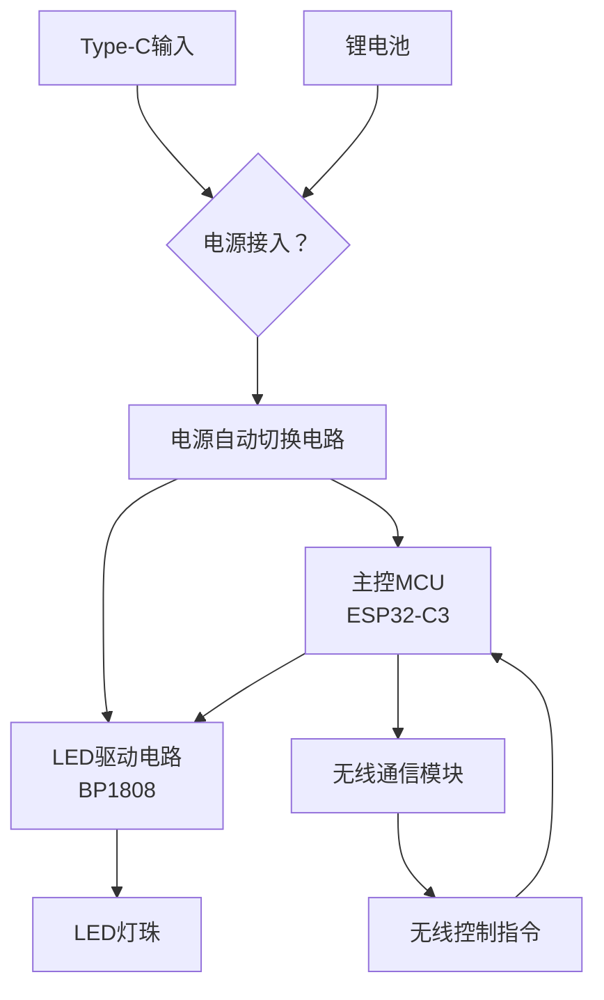

[[PCB]]

>## 项目出发点：
	日常生活中，我发现市面上的磁吸台灯都很廉价，但是不乏有很多缺点和不足
		1.续航普遍较差
		2.控制方案较简单
		3.调光模式不够简单
所以诞生出自己做一款可以多场景使用的一个led磁吸灯的想法，平时可以磁吸在宿舍使用，还可以作为打光灯给人补面光等用处。

---
# 实现功能

+ 多颗 led 顺利点亮，实现无极调光和冷暖无极调节
+ 可以自动切换 typec 直流供电和锂电池供电方案
+ 可以实现 wifi /蓝牙 远控
# 方案

## 调控
采用 ***BP1808*** 高集成度 ic的调控方案

## 电源
可支持 pd 快充，可以同时给电池和灯供电

## 器件

### led选择
找了很久的 led 灯珠,找不到既能符合需求的高显色灯珠,且符合低功耗的要求，蓝光发光量较低的灯珠。
>**市面上的防蓝光方法是两种：**
>- **传统蓝光激发LED**：市面上多数普通LED灯采用蓝光芯片激发黄色荧光粉来产生白光。这种方式难以避免地会使光线中含有较高的蓝光峰值  
> 
>- **紫光激发LED**：这是一种更先进的技术。它使用波长短于蓝光的紫色光作为基础光源来激发特殊配方的荧光粉，从而合成白光。由于根本避开了使用高能蓝光来激发，所以能从源头上显著降低光线中有害蓝光的比例，使得出光的光谱更加连续、均衡，更接近自然光

型号 | 封装
:------------ | :------------:
A-2835D90VW-2-LVR7-S1-08-PCT-HR6/3000K  RA>95 高显色方案| SMD2835-2P
A-2835D90VW-2-LVR7-S1-08-PCT-HR6/6500K | SMD2835-2P
